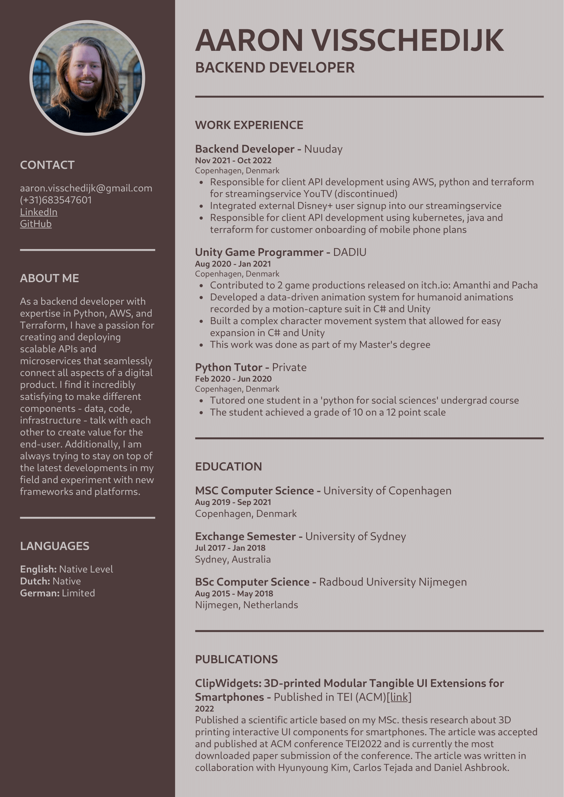

# React Resume Builder

This repo builds my resume on the web which can then be saved to a pdf. Feel free to modify this and use it for your own resume. To change the data just update the `data.tsx` file :)

### Example Output

The default styling results in a resume that looks like this:

### How to run

Make sure you have react installed and run `npm start`

Runs the app in the development mode.\
Open [http://localhost:3000](http://localhost:3000) to view it in the browser.

The page will reload if you make edits.\
You will also see any lint errors in the console.

